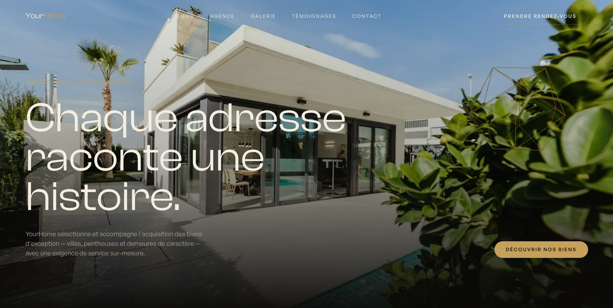

# YourHome — Premium Real Estate Showcase

A **premium real estate agency website** built with Next.js, React and TypeScript, featuring GSAP scroll animations, smooth scrolling, a lightweight 3D hero accent and a fully responsive layout.

---

## Features

- Scroll-driven GSAP animations — zoom, clip-path reveals, pinned horizontal sections
- Smooth scroll powered by Lenis, synced with GSAP/ScrollTrigger
- Text reveal animations via GSAP SplitText
- Automatic animation cleanup in components using `@gsap/react` (`useGSAP`)
- Lightweight 3D accent in the Hero section built with Three.js / React Three Fiber, disabled below 768px for performance
- Optimized images via `next/image`
- Custom design tokens (colors, fonts, spacing) centralized in Tailwind config
- Fully responsive — tablet and mobile breakpoints down to small devices

---

## Technologies Used

- **Next.js 16** (App Router) – Routing, rendering and project structure
- **React 19** – Component architecture
- **TypeScript (strict mode)** – Type safety across the codebase, no `any`
- **Tailwind CSS v4** – Utility-first styling with custom design tokens
- **GSAP 3 + ScrollTrigger + SplitText** – Scroll-based animation engine
- **@gsap/react (useGSAP)** – Automatic animation cleanup in React components
- **Lenis** – Smooth scroll, synchronized with GSAP/ScrollTrigger
- **Three.js + React Three Fiber + drei** – Lightweight 3D accent in the Hero
- **next/image** – Image optimization (Unsplash placeholders, free license)
- **Clash Display & General Sans** (Fontshare, free fonts) – Local `woff2` fonts declared via `@font-face`

---

## Preview

